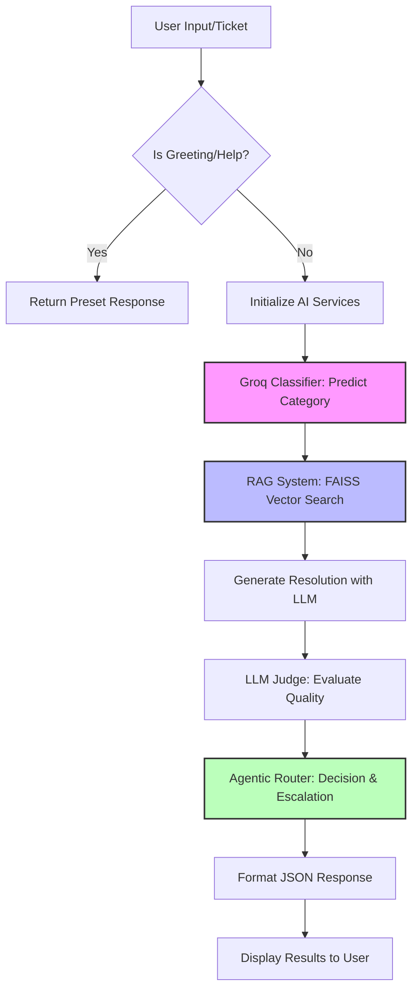
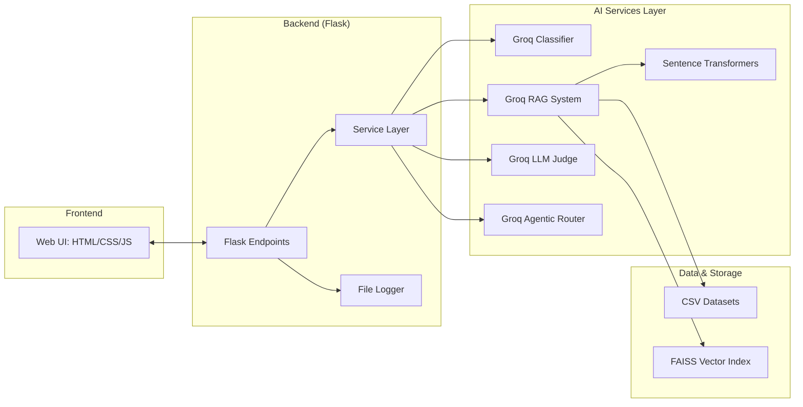
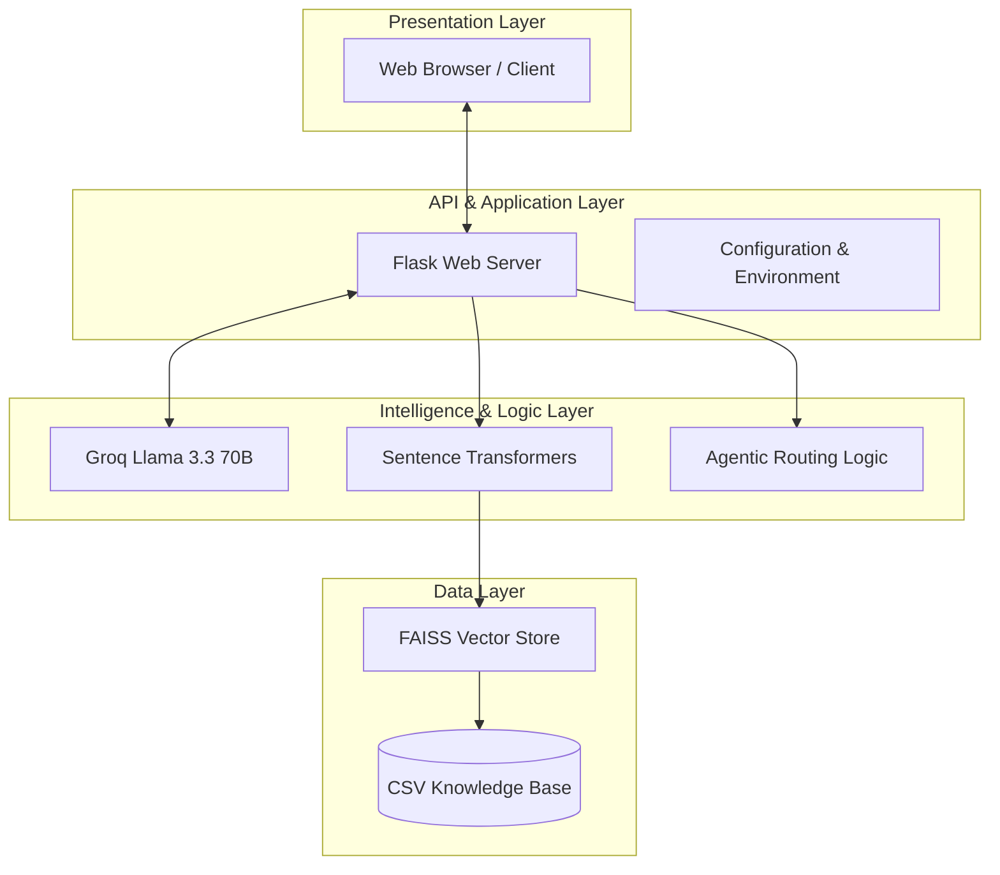
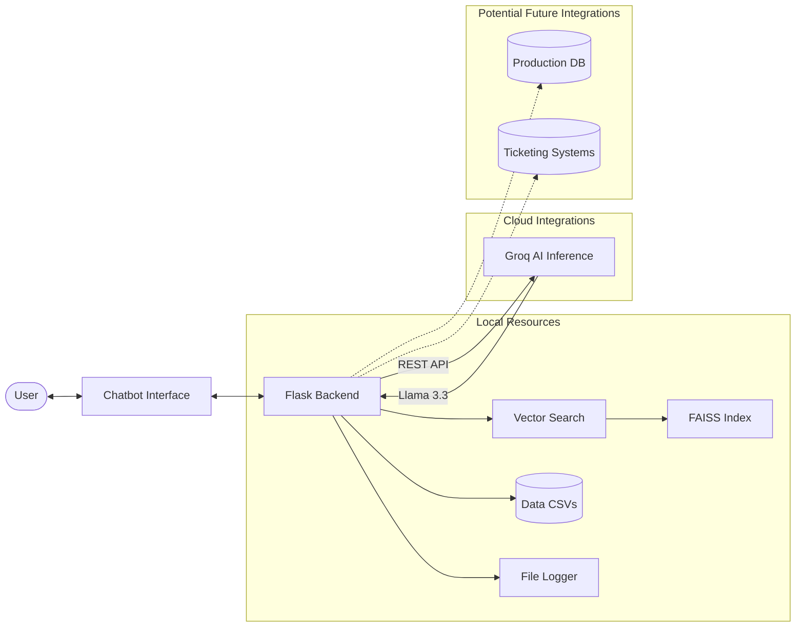

# AI Ticket Routing & Resolution - System Diagrams

This document provides the technical diagrams for the AI Powered Intelligent Ticket Routing & Resolution Agent.

## 1. Flow Diagram
The flow diagram illustrates the end-to-end process from user input to the final response and routing decision.

---

## 2. Component Diagram
This diagram shows the major components and their interactions within the application.

---

## 3. App Architecture
The architecture is based on a layered model, separating presentation, processing, and data.

---

## 4. Overall System Integration
This diagram explains how the app works by integrating with various internal and external systems.

